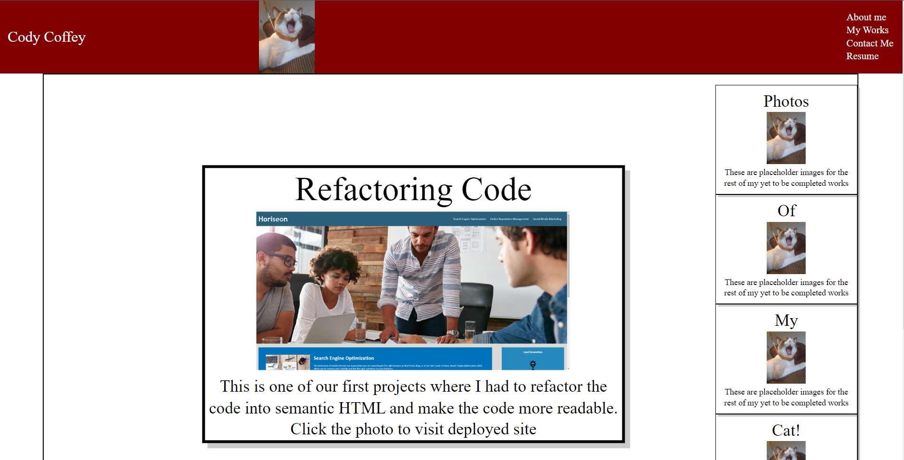

# CodingPortfolio

## Description

This website is designed to show off my growing portfolio to any potential employers or just for some fun information! It is divided into 4 main sections, the showcase of my projects, an about me section, a contact me section, and an interactive photo of my cat for your ammusement!

## User information
Click around and have fun! The main link will link to my other project, the rest of the works are still in progress, so stay tuned and watch this page update!
## Links

Link to Repository
https://github.com/ccoff1798/CodingPortfolio

Deployed Site
https://ccoff1798.github.io/CodingPortfolio/

## Screenshot

## Credits

This project is a solo project, with the help of my teachers in the Full stack bootcamp!

